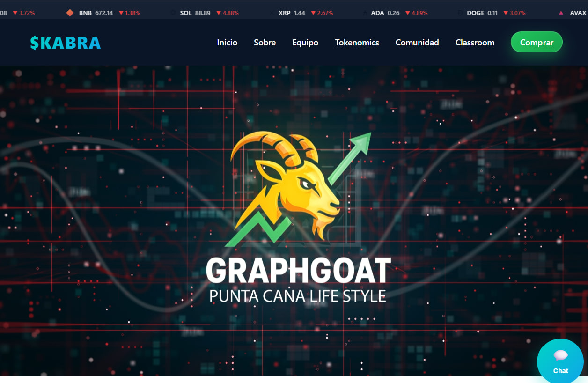
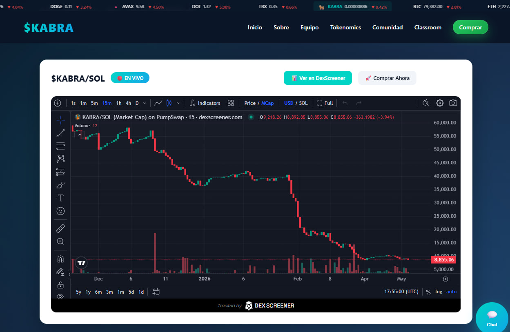
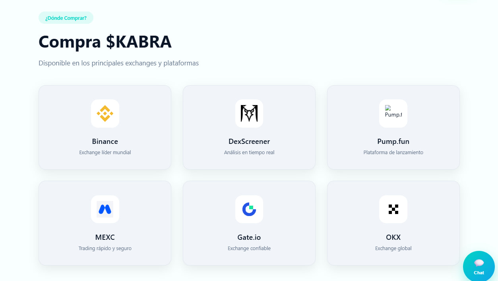
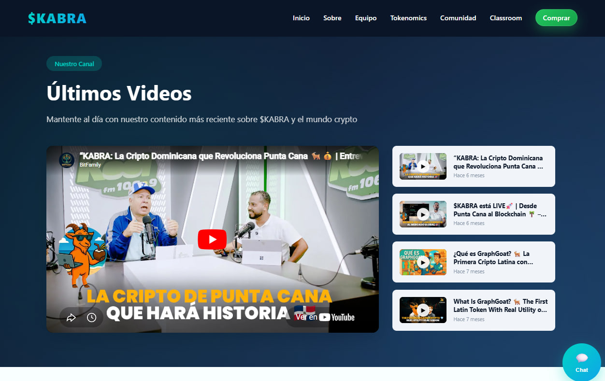
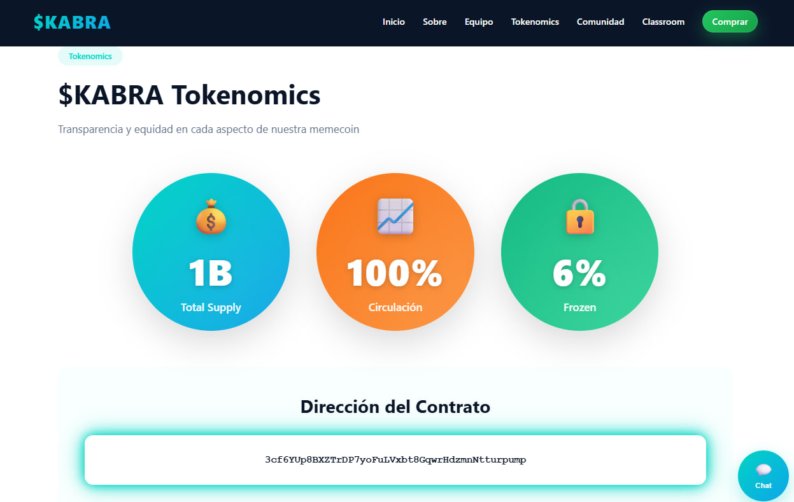
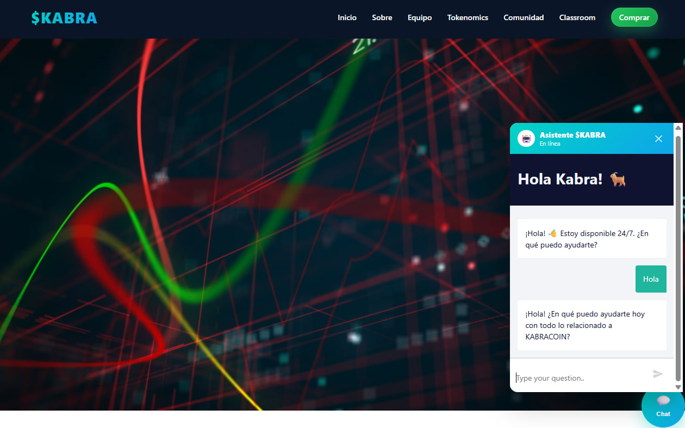

# Kabra Coin

### Landing page para la primera memecoin de Punta Cana, República Dominicana. Construida sobre Solana.

Precio en vivo · Trading Chart · Exchanges · YouTube dinámico · Chat IA · Tokenomics

---

## What is this?

**Kabra Coin ($KABRA)** es la primera memecoin comunitaria de Punta Cana, República Dominicana, desplegada en la blockchain de Solana. Este repositorio es la landing page oficial del proyecto: una web de una sola página que informa, integra datos en tiempo real y conecta a la comunidad con los exchanges donde opera el token.

El sitio no es una vitrina estática. Tiene precios en vivo, un chart de trading embebido, una galería de videos cargada dinámicamente desde YouTube, y un widget de chat con IA construido sobre n8n.

> 🌐 **Live:** [kabracoin.com](https://kabracoin.com/) · ⛓️ Solana · 🌴 Punta Cana, RD

---

## Secciones

### 📊 Price Ticker

Barra fija en la parte superior con precios en tiempo real de $KABRA, BTC, ETH y SOL. Se actualiza cada 30 segundos sin recargar la página.

- **$KABRA:** precio obtenido de DexScreener API (`/latest/dex/tokens/{contract}`) — la fuente correcta para tokens en DEXs de Solana
- **BTC / ETH / SOL:** CoinGecko API con variación 24h
- **Animación:** ticker horizontal con CSS `transform` y `requestAnimationFrame` — sin librerías de animación
- **Indicadores de color:** verde/rojo automático según variación 24h positiva o negativa

---

### 📈 Trading Chart

Chart de trading en vivo embebido directamente desde DexScreener. Par $KABRA/SOL en Solana mainnet.

- **Auto-recovery:** se recarga automáticamente al volver a la pestaña (Page Visibility API) y cada 5 minutos para mantener la conexión WebSocket activa
- **Botón de recarga manual** para forzar refresh sin recargar la página

---

### 💱 Exchanges

Cards con los exchanges donde $KABRA opera actualmente.

- DexScreener, Pump.fun, Gate.io, OKX Web3, Streamflow (vesting)

---

### 🎬 Video Gallery

Galería dinámica cargada desde YouTube Data API v3. Muestra los últimos 6 videos del canal oficial.

- **Carga dinámica:** fetch al canal vía API, sin videos hardcodeados
- **Video principal:** click en miniatura reemplaza el embed principal sin recargar
- **Fallback:** si la API falla, carga un set manual de videos conocidos
- **Timestamps relativos:** "hace 3 días", "hace 2 semanas", etc.

---

### 🔢 Tokenomics

Distribución del supply con stats de Streamflow (vesting contract verificable on-chain).

---

### 💬 Chat IA (n8n)

Widget flotante de chat conectado a un workflow de n8n vía webhook. El bot responde preguntas sobre $KABRA, el proyecto y cómo comprar.

- **Backend:** n8n self-hosted en Easypanel
- **UX:** botón flotante → overlay con iframe → cierre con Escape o botón ✕

---

## Stack

- **HTML5 + CSS3 + Vanilla JS (ES6+):** sin framework, sin build step
- **APIs:** DexScreener, CoinGecko, YouTube Data API v3
- **Embeds:** DexScreener trading chart con auto-recovery
- **Automatización:** n8n self-hosted (Easypanel) para el chat IA
- **Hosting:** VPS Hostinger con deploy via GitHub
- **Iconos:** Font Awesome 6.4

---

## Decisiones de ingeniería

### 🎯 Sin framework, a propósito

Una landing page de memecoin tiene un ciclo de vida corto y alta volatilidad de contenido. No tiene sentido introducir un framework con su ecosistema de dependencias para un sitio que puede reescribirse en días. HTML + CSS + JS nativo despliega con un `git push`, tiene cero dependencias que actualizar, y cualquier dev puede leerlo sin onboarding.

### 📊 DexScreener sobre CoinGecko para $KABRA

CoinGecko no indexa tokens recientes o de bajo market cap de forma confiable. DexScreener sí rastrea cualquier par activo en Solana desde el primer trade. Para el precio de $KABRA, DexScreener es la fuente correcta: da precio, volumen 24h y liquidez del par real.

### 🔄 Chart auto-recovery

Los embeds de DexScreener usan WebSocket internamente. Cuando la pestaña queda en segundo plano, el WebSocket se cae y el chart queda en "Loading pair..." sin reconectarse solo. La solución: Page Visibility API recarga el iframe al volver a la pestaña, más un intervalo de 5 minutos como seguro adicional.

### 🎬 YouTube API dinámica

Si el canal sube un video nuevo, la galería lo muestra automáticamente sin tocar el código. El fallback manual asegura que si la API falla o llega al límite de cuota, el usuario igual ve contenido.

### 🤖 n8n para el chat

El chat necesitaba responder preguntas específicas sobre $KABRA. Una integración directa con un LLM requería un servidor propio para proteger las API keys. n8n self-hosted resuelve eso: el workflow vive en el servidor, el frontend solo hace fetch a un webhook.

---

## Acerca del proyecto

Diseñado y desarrollado por [@tokiopy](https://github.com/tokiopy) para el equipo de **Kabra Coin**, la primera memecoin comunitaria de Punta Cana, República Dominicana.

**Estado:** Production · [kabracoin.com](https://kabracoin.com/)

---

## Otros proyectos

- **[BitcoinLab Bolivia](https://github.com/tokiopy/bitcoinlab-bolivia-showcase):** plataforma de educación Bitcoin con 7 herramientas integradas
- **[Satoshi's Playroom](https://github.com/tokiopy/satoshis-playroom-showcase):** plataforma de gaming Bitcoin con Dominó, Póker y Ajedrez sobre Lightning Network

---

## Contacto

- 💬 **GitHub:** [@tokiopy](https://github.com/tokiopy)
- 📧 **Email:** info@tokiohub.com

---

**From Tokio With ⚡**

